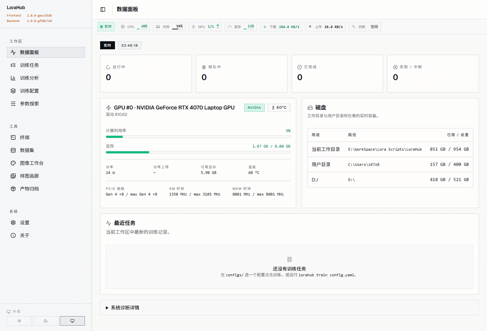
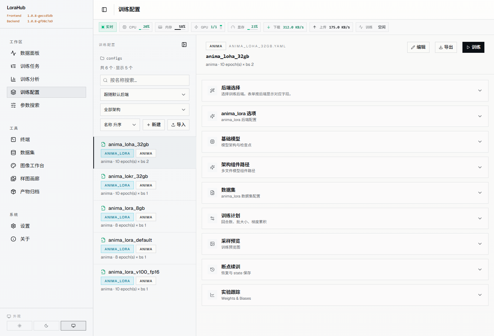
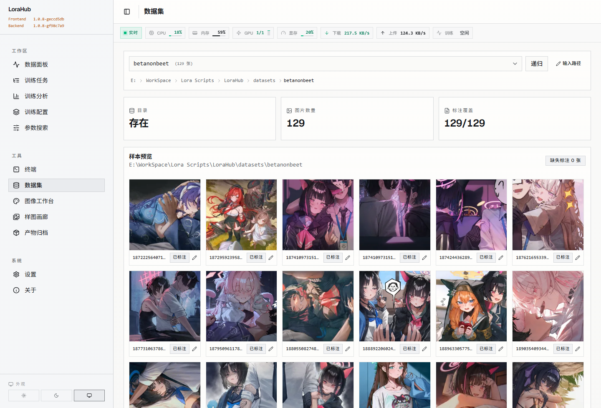
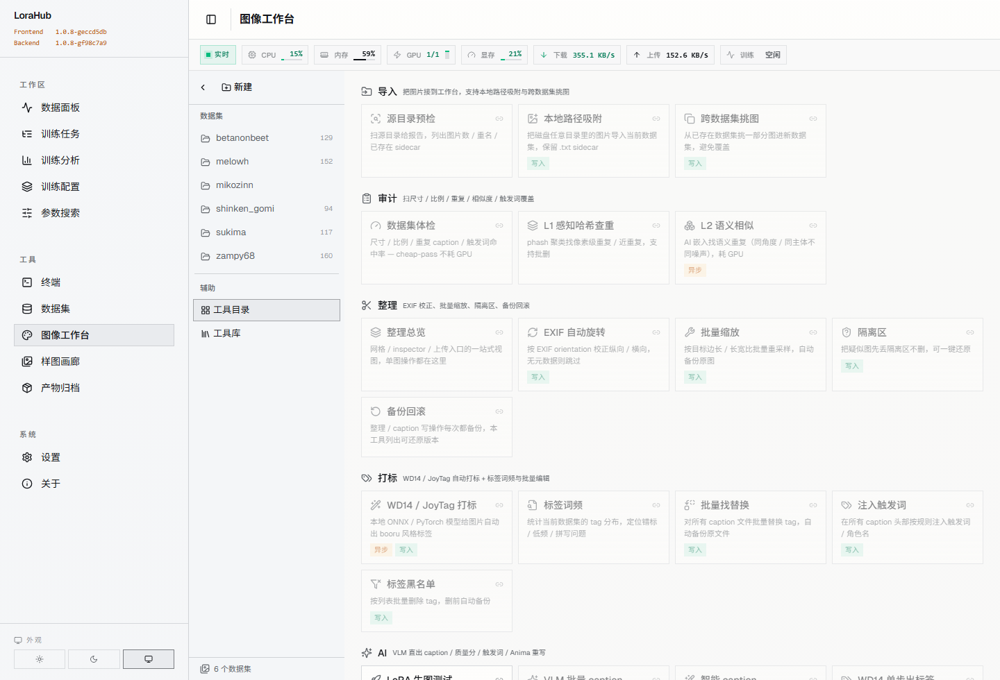
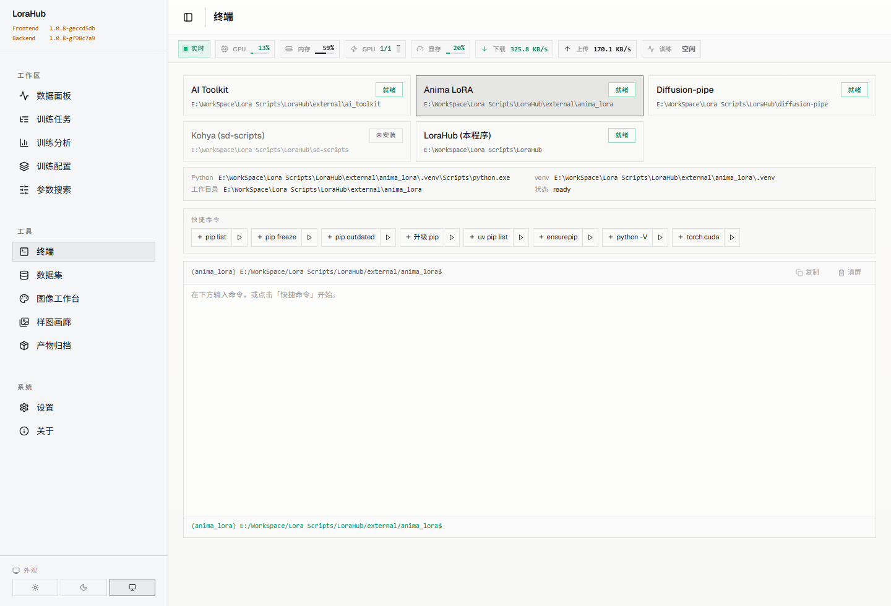
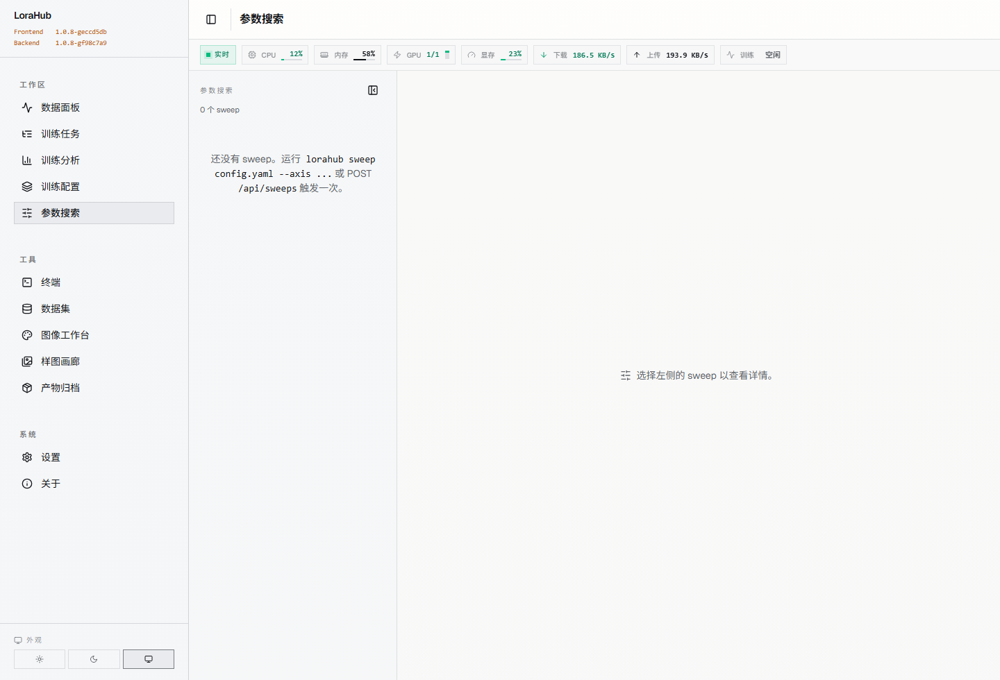

# LoraHub

自托管的 LoRA 训练工作台。把 kohya / diffusion-pipe / anima_lora 三个训练后端套在同一份配置 schema、同一套 REST + SSE API 和同一个 React Web UI 之下。

[](https://www.python.org)
[](LICENSE)

---

## 安装

需要 Python 3.11 或 3.12，Windows / Linux / macOS 可用，训练时需要一块 8 GB+ 显存的 NVIDIA GPU。至少装一个训练后端。

### 一键脚本

`scripts/install.bat`（Windows）或 `scripts/install.sh`（Linux）会从零搭好运行环境：通过 uv 安装 Python 3.12、创建 `.venv`、装 Python 依赖、装便携 Node.js、装前端依赖。所有产物落在项目根目录的 `.lorahub/`、`.venv/`、`.node/` 下，完全自包含。

```powershell
git clone https://github.com/GALIAIS/LoraHub
cd LoraHub
scripts\install.bat              # 默认走 GitHub / PyPI / nodejs.org
scripts\install-cn.bat           # 国内镜像版（gh-proxy + 清华 PyPI + npmmirror）
```

```bash
git clone https://github.com/GALIAIS/LoraHub
cd LoraHub
bash scripts/install.sh          # 国外
bash scripts/install-cn.sh       # 国内镜像版
```

装好后用 `scripts\run.bat` / `scripts/run.sh` 启动：

```text
scripts\run.bat              # 默认生产模式：API + 已构建的 SPA
scripts\run.bat dev          # 开发模式：API + Vite 热更新
scripts\run.bat api          # 仅启动 API
```

或注册全局 `lorahub` CLI（推荐）：

```bash
# Linux / macOS / WSL
.venv/bin/lorahub manage install   # → ~/.local/bin/lorahub

# Windows
.venv\Scripts\lorahub manage install   # → %LOCALAPPDATA%\lorahub\bin\lorahub.cmd

# 之后可在任意目录使用：
lorahub doctor                # 查看环境健康度
lorahub service start         # 启动后台守护（随机端口）
lorahub service start --port 18765  # 指定端口
lorahub service status        # 查看运行状态
lorahub service stop          # 停止
lorahub service enable        # 注册系统级开机自启（Linux/macOS，需 sudo）
lorahub manage update         # 拉最新代码 + 重装依赖 + 重建前端
lorahub manage upgrade        # 切到最新 release tag
lorahub manage build          # 仅重建前端
lorahub --lang en --help      # 切换为英文 help / 输出
```

完整子命令见 `scripts/README.md`。

### 手动安装

```bash
git clone https://github.com/GALIAIS/LoraHub
cd LoraHub
pip install -e ".[api,dev]"
cd web && npm install && cd ..
```

### 训练后端

`kohya` 与 `diffusion-pipe` 通过 CLI 一键引入：

```bash
lorahub bootstrap-kohya              # SD1.5 / SDXL / SD3 / FLUX / Lumina / HunyuanImage / Anima
lorahub bootstrap-diffusion-pipe     # diffusion-pipe + DeepSpeed
```

`anima_lora` 已 vendored 在 `external/anima_lora/`，无需再 clone。它需要独立的 venv（CPython 3.13 + torch 2.11/2.12 nightly + CUDA 13.x），首次安装可在 Web UI 的「设置 → 安装」面板一键 `uv sync`，再用「下载模型」按钮拉取约 14 GB 的 Anima 基础模型。

如需指向已有的 checkout：

```bash
export LORAHUB_KOHYA_SD_SCRIPTS=/path/to/sd-scripts
export LORAHUB_DIFFUSION_PIPE=/path/to/diffusion-pipe
export LORAHUB_ANIMA_LORA_PYTHON=/path/to/anima_lora/.venv/bin/python
```

### 可选依赖

| Extra     | 用途                                       |
| --------- | ------------------------------------------ |
| `api`     | FastAPI 服务（`lorahub serve`）            |
| `gpu`     | WD14 标注通过 `onnxruntime-gpu` 走 CUDA    |
| `tagging` | JoyTag（PyTorch）标注后端                  |
| `dev`     | 测试、lint、mypy、httpx                    |
| `docs`    | mkdocs 文档站                              |

---

## 快速开始

```bash
lorahub init my_character                       # 在 configs/ 下生成模板
$EDITOR configs/my_character.yaml               # 填 checkpoint 与数据集路径
lorahub validate configs/my_character.yaml      # 校验配置
lorahub train    configs/my_character.yaml      # 启动训练
lorahub serve    --port 18765                   # 启动 Web UI + REST API（可选）
```

启动后访问 `http://127.0.0.1:18765`。Job 详情页通过 SSE 实时推送事件，断线后通过 `Last-Event-ID` 续传。

完整使用流程见 [docs/getting-started/quickstart.md](docs/getting-started/quickstart.md)。

---

## 界面预览

| 数据面板 | 训练配置 |
| --- | --- |
|  |  |
| 数据集 | 图像工作台 |
|  |  |
| 终端 | 参数搜索 |
|  |  |

---

## 核心特性

- **三后端一份配置**：在「设置 → 后端配置」选 `kohya` / `diffusion-pipe` / `anima_lora`，三个后端共用同一份 schema 与 UI。
- **可视化配置编辑器**：每个字段按 schema 与后端可见性过滤，锁定字段、警示字段都有徽标提示。
- **图像工作台（Image Studio）**：WD14（默认 `SmilingWolf/wd-eva02-large-tagger-v3`）/ JoyTag 标注、smart-caption（WD14 + 视觉 LLM）、感知哈希去重、批量画质评分。
- **任务调度**：单 GPU 队列，断点续训，多 GPU 通过每槽位 `CUDA_VISIBLE_DEVICES` 切片。重启后非终止任务标记为 `interrupted`，残留训练进程自动回收。
- **实时事件**：`/api/jobs/{id}/sse`、`/api/system/sse`、`/api/backend/bootstrap/sse`，WebSocket 保留为兜底。
- **超参 sweep**：grid、random、Optuna TPE 三种模式，TPE 提供 Pareto 视图，进度跨重启恢复。
- **CLI 与 API 对齐**：`lorahub jobs ls/show/cancel/kill/resume/rerun`、`lorahub sweeps submit/ls`、`lorahub system gpu/info`。
- **anima_lora 完整工作流**：模型下载、Anima transformer + Qwen-Image VAE + Qwen3 文本编码器配套配置、训练时按 epoch 自动出样本图。

---

## 训练后端

| 后端             | 上游                                                                    | 覆盖范围                                                                | 备注                                              |
| ---------------- | ----------------------------------------------------------------------- | ---------------------------------------------------------------------- | ------------------------------------------------- |
| `kohya`          | [kohya-ss/sd-scripts](https://github.com/kohya-ss/sd-scripts)           | SD1.5、SDXL、SD3、FLUX、Lumina、HunyuanImage、Anima                    | 单进程，LoraHub 自建 venv 与 argv。               |
| `diffusion-pipe` | [tdrussell/diffusion-pipe](https://github.com/tdrussell/diffusion-pipe) | DiT 阵列与视频：Wan、HunyuanVideo、LTX、Cosmos、Flux2、Chroma 等        | DeepSpeed pipeline，可选多机 launcher。           |
| `anima_lora`     | [sorryhyun/anima_lora](https://github.com/sorryhyun/anima_lora)         | 仅 Anima DiT                                                            | vendored 在 `external/anima_lora/`，详见下文。    |

每个后端的字段映射在 `lorahub/core/backends/<name>/compiler.py`，schema 字段过滤在 `lorahub/core/config/schema.py`。

### 关于 vendored 的 anima_lora

`external/anima_lora/` 是 [sorryhyun/anima_lora](https://github.com/sorryhyun/anima_lora) 的固定 snapshot，按上游 license 随附。它扩展了 Anima DiT 的训练手段：OrthoLoRA 正交分解、T-LoRA 低秩组合、Hydra 多头适配、postfix 注入、EasyControl 条件控制、IP-Adapter、DMD turbo 蒸馏。

不接受针对 `external/` 的直接 PR——bug 修复请去上游。集成层（`lorahub/core/backends/anima_lora/`）的改动属于 LoraHub 范畴，欢迎 PR。

---

## CLI / API

```bash
lorahub jobs ls                         # 列任务
lorahub jobs cancel <id>                # 优雅停止
lorahub jobs kill <id>                  # SIGKILL 进程组
lorahub jobs resume <id>                # 从最新 checkpoint 续训
lorahub jobs rerun <id>                 # 用同一份配置重跑

lorahub sweeps submit configs/sweep.yaml
lorahub sweeps ls

lorahub system gpu                      # CUDA 设备快照
lorahub system info                     # python / torch / 后端探测
```

REST 端点全部挂在 `/api`：`/api/configs`、`/api/jobs`、`/api/jobs/{id}/sse`、`/api/sweeps`、`/api/image-studio/*`、`/api/system/sse`、`/api/models/download` 等。默认绑定 `127.0.0.1`，无内置鉴权——请勿直接暴露到公网；如需远程访问请加反向代理与认证。

---

## 许可证

LoraHub 采用 **AGPL-3.0-or-later**。完整文本见 [LICENSE](LICENSE)。如果你修改 LoraHub 并通过网络对外提供服务，AGPL 要求把修改后的源码同时开放给这些用户。

`external/anima_lora/` 由其上游 license 管辖，详见 `external/anima_lora/LICENSE`。

---

## 贡献

PR 与 issue 流程见 [CONTRIBUTING.md](CONTRIBUTING.md)。社区行为规范见 [CODE_OF_CONDUCT.md](CODE_OF_CONDUCT.md)。

---

## 社区

本项目已在 [LINUX DO 社区](https://linux.do) 发布，感谢社区的支持与反馈。

---

## 致谢

- [kohya-ss/sd-scripts](https://github.com/kohya-ss/sd-scripts)
- [tdrussell/diffusion-pipe](https://github.com/tdrussell/diffusion-pipe)
- [sorryhyun/anima_lora](https://github.com/sorryhyun/anima_lora)
- [SmilingWolf WD14 / WD-v3 taggers](https://huggingface.co/SmilingWolf)
- [fpgaminer/joytag](https://github.com/fpgaminer/joytag)
- [Optuna](https://optuna.org/)
- [FastAPI](https://fastapi.tiangolo.com/) / [Pydantic](https://docs.pydantic.dev/) / [typer](https://typer.tiangolo.com/) / [rich](https://rich.readthedocs.io/)
- [React](https://react.dev/) / [Vite](https://vitejs.dev/) / [TanStack Query](https://tanstack.com/query)
